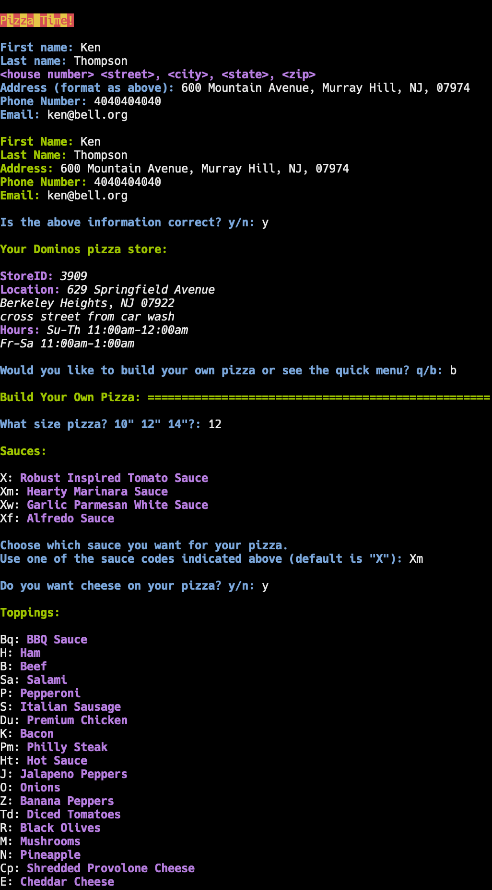

# Pizza Time!

A potential CLI application for ordering pizza, inspired by Cory Arcangel's <a href="https://www.youtube.com/watch?v=PnVaQQVla1Y">Pizza Party project</a>. Unfortunately, the <a href="https://github.com/RIAEvangelist/node-dominos-pizza-api">API</a> that this application relies upon does not work completely as of now. I wrote this at Hack@Brown, and eventually discovered that the pricing and order placing functions are broken. Thus, development on this project has come to a halt for now... :(